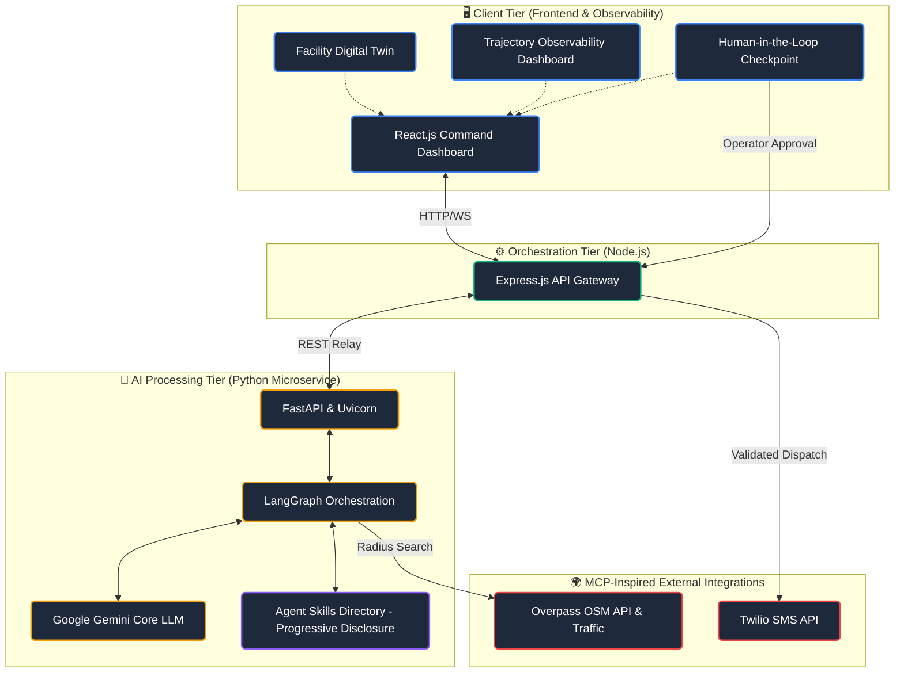

<div align="center">
  
# 🛡️ Rakshak AI

**Zero-Touch, AI-Driven Autonomous Crisis Command Platform**

[](https://reactjs.org/)
[](https://www.python.org/)
[](https://fastapi.tiangolo.com/)
[](https://nodejs.org/)
[](https://ai.google.dev/)

<br/>

### 🔴 [Live Working Prototype](https://rakshak-ai-front-end-008.web.app/)
*(Click to view the deployed application)*

> **⚠️ Note (Free Tier Hosting):** 
> Because this prototype is hosted on free-tier services, the backend servers may "spin down" after a period of inactivity. If the dashboard or AI seems unresponsive or fails on the very first try, **please wait and refresh the page**. It just takes a moment for the AI microservices to wake up!

</div>

---

> **The Problem:** Hospitality venues face unpredictable, high-stakes emergencies that demand instantaneous reactions. Critical information is often siloed, fracturing communication between distressed guests, staff, and first responders resulting in fatal delays.
>
> **The Solution:** **Rakshak AI** acts as an autonomous digital dispatcher and crisis response platform. Built around **Spec-Driven Development** (defined in [agents.md](agents.md)), it replaces manual emergency calls and fragmented chatter with an AI pipeline that automatically analyzes threats, dynamically maps nearest emergency stations, and executes verified dispatches under strict human oversight.

---

## ✨ Core Features & Concepts

- **🧠 LangGraph Agent Pipeline:** A Python-powered LangGraph agent that ingests incident data and autonomously evaluates threat severity without human bottleneck.
- **👁️ Trajectory Observability (Chain-of-Thought):** A dedicated UI panel provides full visibility into the agent's observable execution path, reasoning checkpoints, and decision flow. This operator observability allows commanders to monitor real-time decision steps, debug agent behavior, and avoid fragile success traps without exposing internal hidden model states.
- **🛡️ Human-in-the-Loop (HITL) Checkpoint:** High-stakes external actions (such as emergency SMS dispatches) require human confirmation during a dedicated 10-second approval window. This Human-in-the-Loop checkpoint prevents unintended autonomous actions and builds **Effective Trust** between human dispatchers and the AI.
- **🗺️ MCP-Inspired Tool Integration:** Rakshak AI's external services (Twilio SMS API, Overpass API, Maps, and Geolocation) are architected following the Model Context Protocol (MCP) design philosophy to encourage standardized, secure, and extensible agent-tool communication.
- **🏢 Digital Twin & Spatial Awareness:** Includes a 3D Facility Twin to give on-site security spatial layout awareness of the threat location within the building.
- **❤️ Rakshak Neural Core:** A central visual indicator tracking system status and threat levels in real time.
- **🎮 Built-In Crisis Simulator:** Allows stakeholders to inject simulated emergency scenarios into the system to test AI response latency safely.
- **📦 Agent Skills & Progressive Disclosure:** Modular capabilities are organized as Agent Skills inside `.agents/skills/` (such as `agents-for-good`). The AI loads metadata on demand via **Progressive Disclosure**, preventing context rot and maintaining high operational efficiency.
- **🔒 Guardrails & Deterministic Validation:** Includes input parameter validation, rate limiting, and automated pre-flight script checks (`validate_safety_config.py`) to ensure fail-safe operation.

---

## 🛠️ Tech Stack & Design Philosophy

- **AI & Logic Engine:** Google Gemini LLM, LangChain, LangGraph, Python 3, FastAPI, Uvicorn.
- **Frontend Command Center:** React.js (Vite), Framer Motion, React Flow (`@xyflow/react`), Modern CSS.
- **API Gateway & Orchestration:** Node.js, Express.js.
- **MCP-Inspired External Integrations:** Twilio SMS API, Overpass API (OpenStreetMap), TomTom Traffic API, OSRM Routing.
- **Spec-Driven Development:** Global durable specification maintained in [agents.md](agents.md).

---

## 🏗️ System Architecture



### Architectural Highlights:
- **Progressive Disclosure via Agent Skills:** Skills in `.agents/skills/` load full guidance only when relevant triggers occur, avoiding context bloat.
- **MCP-Inspired Extensibility:** External services (Twilio, Overpass API, Maps, Geolocation) are architected following the Model Context Protocol (MCP) design philosophy to encourage standardized, secure, and extensible agent-tool communication.
- **Human-in-the-Loop Checkpoints:** High-stakes dispatches require explicit human confirmation during a 10-second approval window to build Effective Trust.
- **Trajectory Observability:** Observable execution traces surface every step from detection to tool selection without revealing internal hidden model states.

---

## 📂 Repository Structure

```
RAKSHAK-AI/
├── agents.md                            # Durable Project Specification (Spec-Driven Development)
├── README.md                            # Project Overview & Documentation
├── render.yaml                          # Cloud Service Deployment Specification
├── rakshak.bat                          # Command Launcher Script
├── server.js                            # Root Bootstrap Entrypoint
├── .agents/                             # Agent Skills Directory (Progressive Disclosure)
│   └── skills/
│       └── agents-for-good/             # Safety, Accessibility & Ethics Skill
│           ├── SKILL.md                 # Metadata & SOP Instructions
│           ├── references/
│           │   └── safety_guidelines.md # Emergency System Safety Standards
│           └── scripts/
│               └── validate_safety_config.py # Deterministic Safety Validator
├── backend/
│   ├── backend-node/                    # Node.js API Gateway & Twilio Relay
│   └── backend-python/                  # LangGraph AI Agent & FastAPI Service
├── frontend/                            # React.js Command Center Dashboard
├── Project_Images/                      # Screenshots & Visual Documentation
└── Report                               # Technical Capabilities Document
```

---

## 🛡️ Safety Validation & Guardrails

To enforce deterministic validation before deployment, Rakshak AI includes an automated safety configuration validator:

```bash
python .agents/skills/agents-for-good/scripts/validate_safety_config.py
```
*(or via npm)*:
```bash
npm run validate:safety
```

### Deterministic Guardrails:
- **Pre-Flight Configuration Audit:** Verifies that API credentials (Gemini, Twilio) are properly configured and not set to placeholder strings before starting microservices.
- **Input & Tool Call Validation:** Geolocation coordinates, phone numbers, and threat levels are sanitized prior to invoking external tools.
- **Fail-Safe Degradation:** If live APIs encounter outages, the system degrades safely to pre-cached local emergency station databases.

---

## 🎓 Alignment with Google's AI Agents Course

This repository demonstrates key concepts taught in Google's **AI Agents** course:

- **✓ Agent Skills:** Modular capability packages housed under `.agents/skills/` providing specialized instructions and SOPs.
- **✓ Progressive Disclosure:** Small metadata footprints in active memory trigger skill loading only when required, preventing context rot.
- **✓ MCP Design Philosophy:** Rakshak AI's external services are architected following the Model Context Protocol (MCP) design philosophy to encourage standardized, secure, and extensible agent-tool communication.
- **✓ Human-in-the-Loop (HITL):** High-stakes emergency dispatches require explicit human confirmation during a 10-second approval window, establishing Effective Trust before action execution.
- **✓ Trajectory Observability:** Observable execution steps are visualised live on the dashboard, giving operators clear insight into agent progression, execution traces, and reasoning checkpoints to debug agent behavior and avoid fragile success traps.
- **✓ Guardrails:** Deterministic validation, parameter sanitization, rate limiting, and safe fallback mechanisms ensure operational safety in crisis scenarios.
- **✓ Deterministic Validation:** Automated validation scripts (`validate_safety_config.py`) verify safety parameters and configuration integrity prior to deployment.
- **✓ Spec-Driven Development:** The durable global specification in [agents.md](agents.md) guides evolving implementations while keeping project goals aligned over time.

---

## 🚀 Local Development

Install dependencies for all workspaces:

```bash
npm run setup
```

Run pre-flight safety validation:

```bash
npm run validate:safety
```

Run all services concurrently:

```bash
npm run dev
```

**Default local ports:**
- Frontend: `http://localhost:5173`
- Node relay: `http://localhost:3000`
- Python agent: `http://localhost:8000`

---

## ☁️ Deployment

The included `render.yaml` handles deploying the microservices:

1. `rakshak-backend` as the public web app and Node relay
2. `rakshak-agent` as the Python LangGraph agent

**Deployment details:**
- Node service builds the frontend and serves `frontend/dist` directly.
- Node service communicates with Python agent via `PYTHON_AGENT_URL`.

---

## 🔐 Environment Variables

**Python Agent (`backend/backend-python/.env`):**
- `GEMINI_API_KEY`
- `TOMTOM_API_KEY` *(Optional fallback)*

**Node Relay (`backend/backend-node/.env`):**
- `TWILIO_ACCOUNT_SID`
- `TWILIO_AUTH_TOKEN`
- `TWILIO_PHONE_NUMBER`

**Frontend (`frontend/.env` - Optional):**
- `VITE_BACKEND_URL`
