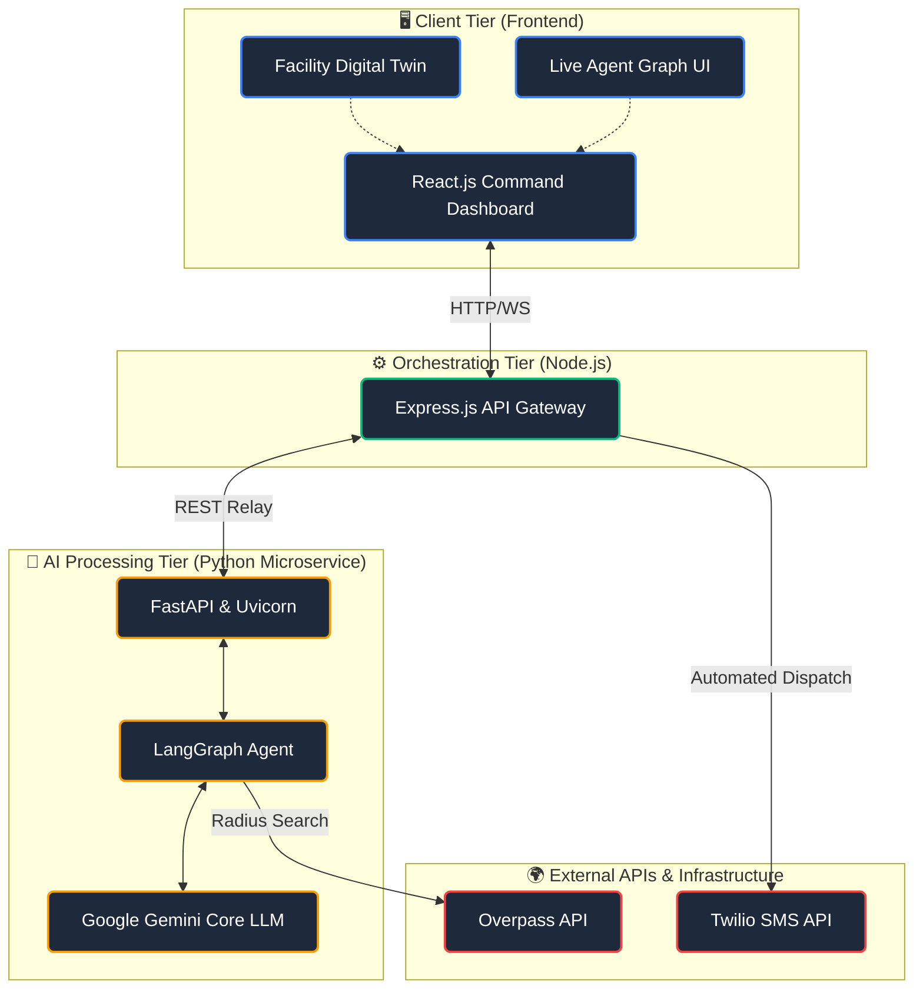

<div align="center">
  
# 🛡️ Rakshak AI

**Zero-Touch, AI-Driven Autonomous Crisis Command Platform**

[](https://reactjs.org/)
[](https://www.python.org/)
[](https://fastapi.tiangolo.com/)
[](https://nodejs.org/)
[](https://ai.google.dev/)

<br/>

### 🔴 [Live Working Prototype] - https://rakshak-ai-front-end-008.web.app/
*(Click to view the deployed application)*

</div>

---

> **The Problem:** Hospitality venues face unpredictable, high-stakes emergencies that demand instantaneous reactions. Critical information is often siloed, fracturing communication between distressed guests, staff, and first responders resulting in fatal delays.
>
> **The Solution:** **Rakshak AI** bypasses human panic by acting as an autonomous digital dispatcher. It replaces manual 911 calls and fragmented radio chatter with an AI pipeline that automatically analyzes threats, dynamically maps the nearest specific emergency stations, and executes automated SMS dispatches to first responders.

## ✨ Standout Features

- **🧠 Autonomous Agent Pipeline:** A Python-powered LangGraph agent that ingests incident data and autonomously evaluates threat severity without human bottleneck.
- **👁️ Transparent "Chain-of-Thought":** A dedicated UI panel exposes the AI’s internal logic, showing human operators exactly *why* it escalated a threat and *how* it plans to mitigate it.
- **🗺️ Hyper-Local Dynamic Mapping:** Integrates with the Overpass API to scan the immediate geographical radius of the venue to pinpoint the exact nearest Police, Fire, or Medical units.
- **💬 Zero-Touch SMS Dispatch:** Automatically formats and blasts critical SOS SMS messages to the nearest identified emergency responders via Twilio.
- **🏢 Digital Twin & Spatial Awareness:** Includes a 3D Facility Twin to give on-site security spatial layout awareness of the threat location within the building.
- **❤️ Rakshak Neural Core:** A central, visually dynamic pulsing orb that acts as the real-time heartbeat of the system, instantly shifting states (Cyan to Red) to provide visceral threat awareness.
- **🎮 Built-In Crisis Simulator:** Allows stakeholders to artificially inject emergencies into the system to run fire drills and test AI response latency safely.

## 🛠️ Cutting-Edge Tech Stack

**Rakshak AI is built on a scalable Microservices Architecture:**

*   **AI & Logic Engine:** Google Gemini LLM, LangChain, LangGraph, Python 3, FastAPI, Uvicorn.
*   **Frontend Command Center:** React.js (Vite), Framer Motion, React Flow (`@xyflow/react`), Modern CSS.
*   **API Gateway & Orchestration:** Node.js, Express.js.
*   **External Integrations:** Twilio SMS API, Overpass API (OpenStreetMap).

## 🏗️ System Architecture



---

## 🚀 Local Development

Install dependencies for all workspaces:

```bash
npm run setup
```

Run all three services together concurrently:

```bash
npm run dev
```

**Default local ports:**
- Frontend: `http://localhost:5173`
- Node relay: `http://localhost:3000`
- Python agent: `http://localhost:8000`

## ☁️ Deployment

The included `render.yaml` handles deploying the microservices:

1. `rakshak-backend` as the public web app and Node relay
2. `rakshak-agent` as the Python LangGraph agent

**Important deployment behavior:**
- The Node service builds the frontend and serves `frontend/dist` directly.
- The Node service talks to the Python agent through `PYTHON_AGENT_URL`.
- On Render, `PYTHON_AGENT_URL` is populated from the Python service `hostport`, which the Node backend normalizes to an internal `http://` URL.

## 🔐 Required Environment Variables

**Python Agent (`backend/backend-python/.env`):**
- `GEMINI_API_KEY`
- `TOMTOM_API_KEY` *(Optional fallback)*

**Node Relay (`backend/backend-node/.env`):**
- `TWILIO_ACCOUNT_SID`
- `TWILIO_AUTH_TOKEN`
- `TWILIO_PHONE_NUMBER`

**Frontend (`frontend/.env` - Optional):**
- `VITE_BACKEND_URL` *(If the frontend is served by the Node relay in production, no override is required).*
